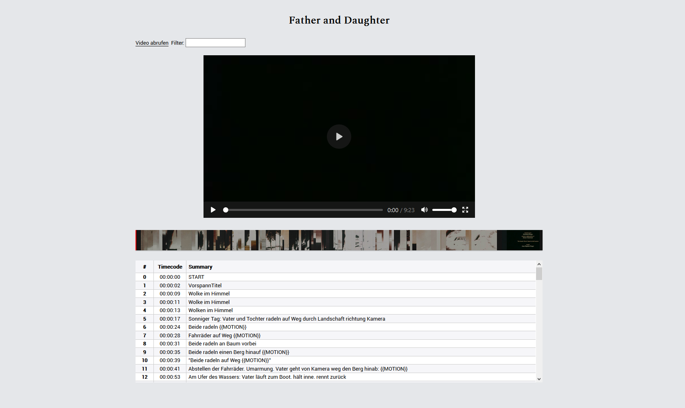

# fei-viewer

Display interactive FEI film protocols in your browser

## Usage

To test the interface, visit [https://hubendubler.github.io/fei-viewer/](https://hubendubler.github.io/fei-viewer/). Then drag and drop the files from the `examples` folder
